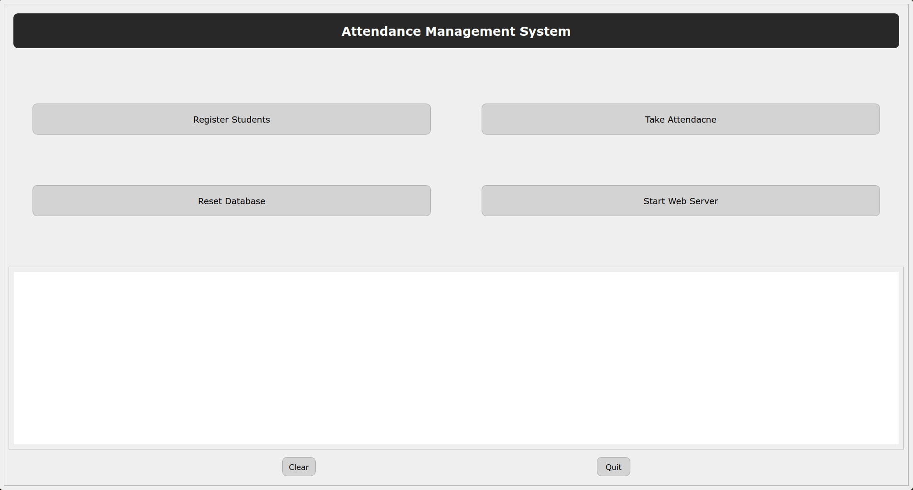

# Attendance Management System Using Facial Recognition

This mini-project helps with attendance management using facial recognition by using Raspberry Pi Pico WH for indicating the user with LEDs and Buzzer. More about the microcontroller [README.md](./pyboard/README.md) and the code is in [/pyboard](./pyboard/).

The code has a GUI programmed using `PyQt5`.


1. **Register Students**
	- Runs `regui.py` which opens a window with input fields for `Student Name` and `USN` with two button `Ok` and `Cancel` on clicking opens up the webcam to save the `Student Name`, `USN` and `Image Path` in the database and image itself is saved locally on the machine in a directory called `student_images`.
2. **Take Attendance**
	- Runs `attendance.py` which requires at-least one student registered and the web-server running. If these conditions are satisfied, it opens up the webcam to detect the face, if the face is matched with registered face, marks the attendance and posts the name of detected face to the web-server.
3. **Reset Database**
	- Runs a function in `database.py` to drop all documents in the collections.
4. **Start Web Server**
	- Runs `webserver.py` as a background thread and starts the `WSIG` server with `Flask` app. If the web-server is running the button toggles to `Stop Web Server`.
5. **Output Window**
	- Shows all the print statements and instructions helping the user know what's going on.
6. **Clear Button**
	- Just clears the output window.
7. **Quit Button**
	- Quits the main window, if the web-server is running, stops the server before exiting.

## Initialization and Setup

1. Clone the repository.\
`git clone https://gitlab.com/neheesh/attendance_mgmt_sys.git`
2. Change into the directory.\
`cd attendance_mgmt_sys`
3. Set up a python virtual environment.\
`python -m venv ./`
4. Activate the virtual environment.\
`source bin/activate`
5. Install the requirements needed for this project.\
`pip install -r requirements.txt`.
6. Create a account on `mongodb atlas`.
	- create a new project.
	- make a new `cluster`.
	- click on the `Add My Own Data` button.
	- name the `database`.
	- create the `collections` for storing `attendance` and `registration`.
	- enable the `Data API` and get the `URL Endpoint` and `API Key`. (Used in micro-python for initializing the mongodb for raspberry pi pico)
	- add your `public IP address` in the network access or click on `Add Current IP Address` button in the network access tab.
	- refer the documentation for more details [here](https://www.mongodb.com/docs/atlas/tutorial/deploy-free-tier-cluster/) and [here](https://www.mongodb.com/resources/products/fundamentals/create-database).
7. In `database.py` define the `ATLAS_URI`, `DB_NAME`, `COLL_NAME_A`, and `COLL_NAME_R`. Refer the documentation [here](https://www.mongodb.com/docs/manual/reference/connection-string/) and [here](https://www.mongodb.com/docs/atlas/driver-connection/) for more details. Assigned `COLL_NAME_A` and `COLL_NAME_R` creates the new collection if that particular collection is not created in Step 6 or if there is any typo during defining the variables.

```
ATLAS_URI = 'mongodb+srv://<username>:<password>@<clusterName>.mongodb.net/?retryWrites=true&w=majority'
DB_NAME = 'database'
COLL_NAME_A = 'collection attendance'
COLL_NAME_R = 'collection registration'
```

8. Optional
	- Specific port number can be assigned in `webserver.py` if needed. (Web server starts on 0.0.0.0 and port 5000 by default). If changed, the POST requests in `attendance.py` and GET requests in the micropython code [main.py](./pyboard/main.py) that runs on 'raspberry pi pico wh' needs to changed accordingly.
9. Run `main.py`.\
`python main.py`
