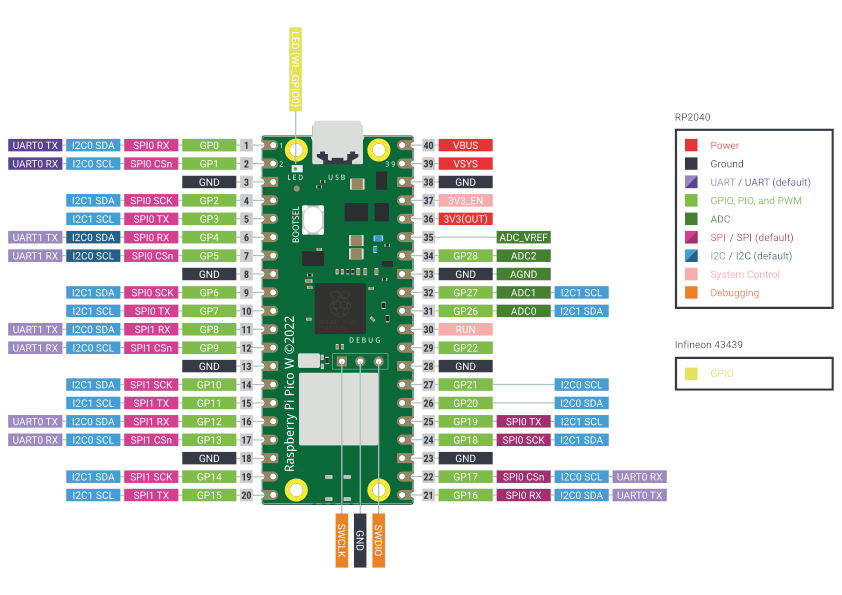
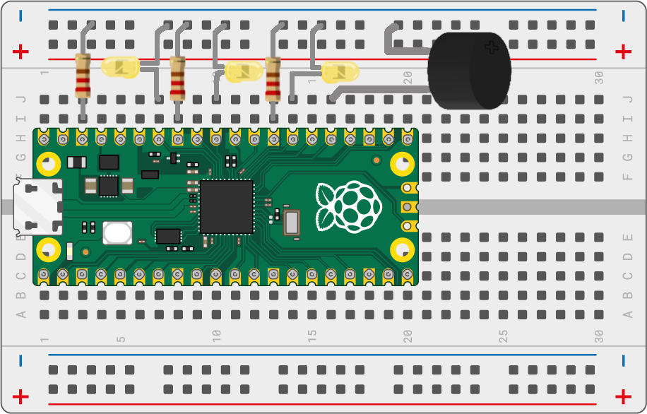

# MicroPython Attendance System

This project utilizes MicroPython on an Raspberry Pi Pico WH microcontroller to implement an attendance system. It connects to a server over WiFi, retrieves task names, queries a MongoDB database for attendance records, and provides visual and auditory feedback based on the task status.

## Hardware Requirements

- Microcontroller (e.g., Raspberry Pi Pico WH, ESP32)
- LEDs (Red, Green, Blue)
- Buzzer
- WiFi module compatible with MicroPython
- Other components as per your setup (e.g., resistors, wires)

## Software Requirements

- MicroPython firmware flashed on the microcontroller
- `myrequest` module for handling HTTP requests (custom implementation since as of this writing the urequests lib uses HTTP 1.0 where mongodb needs HTTP 1.1) [Workaround](https://www.mongodb.com/community/forums/t/upgrade-required-response-code-426-when-using-data-api-on-a-fresh-m0-cluster/282232/2)
- Necessary Python libraries for development and deployment
- Thonny for the IDE or `rshell` can be used.

## Installation and Setup

1. **Flashing MicroPython:**
   - Flash MicroPython firmware onto your Raspberry Pi Pico WH or similar microcontroller.

2. **Uploading Files:**
   - Upload the Python scripts (`main.py`, `myrequest.py`, etc.) to your microcontroller using a tool like `rshell`, `ampy` or a dedicated IDE with MicroPython support.

3. **Configuring WiFi:**
   - Edit `SSID` and `PSK` variables in `main.py` to match your WiFi network credentials.

4. **Configuring Server URL:**
   - Replace `[IP_ADDR]` in `main.py` with the actual IP address of your server.
   - Set `<mongodb dataapi>`, `<data endpoing>` and `<api-key>` variables to appropriate values for MongoDB API integration.
   - Set the `dataSource`, `database`, `collection` in the `searchPayload`.

5. **Connecting Hardware:**
   - Connect LEDs and buzzer to the GPIO pins as defined in `main.py` (adjust pin numbers if necessary).

6. **Raspberry Pi Pico WH Pinout Diagram:**\

7. **Circuit Diagram**:
	- There are total of four LEDs and one buzzer. GP28, GP26, GP21, and GP19 respectively.\

## Usage

1. Power on your microcontroller.
2. The system will attempt to connect to the configured WiFi network.
3. Once connected, it will continuously query the server for tasks.
4. LEDs will indicate the status (Red for error/rejection, Green for acceptance, Blue for server connection issues, and On-board LED Indicator for idle).
5. Buzzer will play corresponding tones for each status (error, rejection, acceptance, idle).

## Notes

- Adjust `tones` dictionary in `main.py` for different musical notes and frequencies.
- Customize `error`, `reject`, `accept`, and `idle` sequences in `main.py` for desired audio feedback.

## Troubleshooting

- If the system fails to connect to WiFi, check SSID and PSK configurations.
- Ensure the server is accessible and configured correctly in `main.py`.
- Check hardware connections and GPIO pin assignments.
