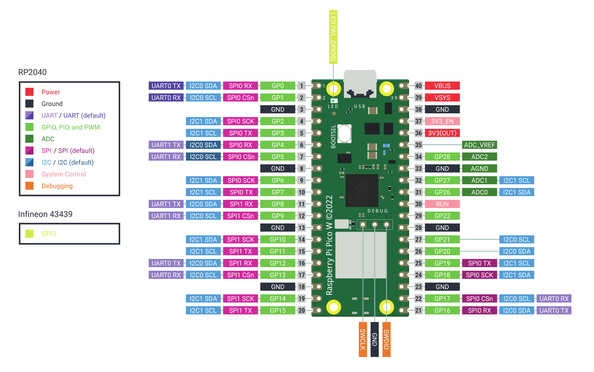

# MicroPython Attendance System

This project utilizes MicroPython on an Raspberry Pi Pico WH microcontroller to implement an attendance system. It connects to a server over WiFi, retrieves task names, queries a MongoDB database for attendance records, and provides visual and auditory feedback based on the task status.

## Hardware Requirements

- Microcontroller (e.g., Raspberry Pi Pico WH, ESP32)
- LEDs (Red, Green, Blue)
- Buzzer
- WiFi module compatible with MicroPython
- Other components as per your setup (e.g., resistors, wires)

## Software Requirements

- MicroPython firmware flashed on the microcontroller
- `myrequest` module for handling HTTP requests (custom implementation since as of this writing the urequests lib uses HTTP 1.0 where mongodb needs HTTP 1.1) [Workaround](https://www.mongodb.com/community/forums/t/upgrade-required-response-code-426-when-using-data-api-on-a-fresh-m0-cluster/282232/2)
- Necessary Python libraries for development and deployment
- Thonny for the IDE or `rshell` can be used.

## Installation and Setup

1. **Flashing MicroPython:**
   - Flash MicroPython firmware onto your Raspberry Pi Pico WH or similar microcontroller.

2. **Uploading Files:**
   - Upload the Python scripts (`main.py`, `myrequest.py`, etc.) to your microcontroller using a tool like `rshell`, `ampy` or a dedicated IDE with MicroPython support.

3. **Configuring WiFi:**
   - Edit `SSID` and `PSK` variables in `main.py` to match your WiFi network credentials.
   	```
	SSID = "my network"
	PSK = "my password"
	```
4. **Configuring Server URL:**
	- Replace `[IP_ADDR]:[PORT]` in `main.py` with the actual IP address of your server.\
		`url = "http://192.168.1.1:5000/tasks"`
   	- Set `<mongodb dataapi>`, `<data endpoint>` and `<api-key>` variables to appropriate values for MongoDB API integration.
   		```
		URL = "[URL]"
		API_KEY = "[API KEY]"
		```
5. **Define the search payload in the `find` function.**
	- Set the `dataSource`, `database`, `collection` in the `searchPayload`.
	```
	searchPayload = {
		"dataSource": "<cluster name>",
		"database": "<database name>",
		"collection": "<attendance collection name>",
		"filter": filter_dictionary,
		"projection": projection_dictionary,
	}
	```
6. **Connecting Hardware:**
   - Connect LEDs and buzzer to the GPIO pins as defined in `main.py` (adjust pin numbers if necessary).

7. **Raspberry Pi Pico WH Pinout Diagram:** \


8. **Circuit Diagram**: \
 \
This circuit involves a Raspberry Pi Pico WH, a half-sized breadboard, three LEDs, a buzzer, and three 330-ohm resistors. Here’s how the components are connected.
	1. **Components**
		- Raspberry Pi Pico WH
		- Breadboard
		- Three LEDs (Red, Blue, Green)
		- Buzzer
		- Three 330-ohm Resistors
		- Jumper Wires
	2. **Connections**
		- **Raspberry Pi Pico WH** - Placed on the half-sized breadboard with pins straddling the central gap.
		- **LED Connections** \
		Red LED - Anode (long leg) connected to GP26 (Pin 31) on the Pico. Cathode (short leg) connected to a 330-ohm resistor, which is connected to the ground rail. \
		Blue LED - Anode connected to GP21 (Pin 27) on the Pico. Cathode connected to a 330-ohm resistor, which is connected to the ground rail. \
		Green LED - Anode connected to GP28 (Pin 34) on the Pico. Cathode connected to a 330-ohm resistor, which is connected to the ground rail.
		- **Buzzer Connection** \
		Positive terminal connected to GP19 (Pin 25) on the Pico. Negative terminal connected to the ground rail.
		- **Resistor Placement** \
		330-ohm Resistor 1 - Connected between the cathode of the Red LED and the ground rail. \
		330-ohm Resistor 2 - Connected between the cathode of the Blue LED and the ground rail. \
	        330-ohm Resistor 3 - Connected between the cathode of the Green LED and the ground rail.
		- **Ground and Power Connections** \
		All ground connections from the LEDs, buzzer, and resistors are connected to the ground rail on the breadboard. Ensure the Pico's ground pin (GND) is also connected to the ground rail.

## Usage

1. Power on your microcontroller.
2. The system will attempt to connect to the configured WiFi network.
3. Once connected, it will continuously query the server for tasks.
4. LEDs will indicate the status (Red for error/rejection, Green for acceptance, Blue for server connection issues, and On-board LED Indicator for idle).
5. Buzzer will play corresponding tones for each status (error, rejection, acceptance, idle).

## Notes

- Adjust `tones` dictionary in `main.py` for different musical notes and frequencies.
- Customize `error`, `reject`, `accept`, and `idle` sequences in `main.py` for desired audio feedback.

## Troubleshooting

- If the system fails to connect to WiFi, check SSID and PSK configurations.
- Ensure the server is accessible and configured correctly in `main.py`.
- Check hardware connections and GPIO pin assignments.
